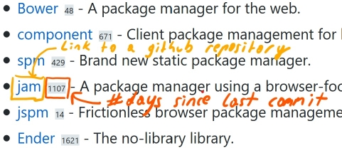

# Github Activity Indicator

A browser plugin, that augments links to github repositories.



## Getting Started as User

  1. Seach for the "Github Activity Indicator" extension in the Chrome or Firefox.
  2. Install
  3. Visit any page on github.com such as [awesome javascript](https://github.com/sorrycc/awesome-javascript)
  4. If the page contains links to the roots of other repositories, a little icon will be shown next to the repository link. The number indicates the number of days when the last commit to the repository occurred.

### Optional

The plugin uses a low priviledged github token per default. Private repositories will not be visible. Go to the plugin settings, to add your own github api token. See [this documentation](https://help.github.com/en/articles/creating-a-personal-access-token-for-the-command-line) on how to create your own token. The extension requires no scopes to be set explicitly.

## Getting Started as Developer

### Prerequisites for Dev

Development was done with Firefox. Install the web-ext utility as [described here](https://extensionworkshop.com/documentation/develop/getting-started-with-web-ext/#installation-section).

### Installing

A step by step series of examples that tell you how to get a development env running

Clone this repository

```
git clone https://github.com/derhackler/githubactivityindicator
```

Navigate to the folder

```
cd githubactivityindicator
```

Run it in a local browser. Changes will be automatically reloaded.

```
cd githubactivityindicator/extension
```

Visit e.g. [awesome javascript](https://github.com/sorrycc/awesome-javascript) to see the indicator extension in action.

## Running the tests

Which tests? You're currently the tester of the extension...

At the very least please run lint and resolve any errors:

```
web-ext lint
```

I'd very much appreciate a pull request with some automated tests.

## Deployment

Create the package

```
web-ext build
```

## Built With

* [Firefox](http://www.mozilla.org/) - Last browser standing against Chromium
* [Visual Studio Code](https://code.visualstudio.com/) - Great editor

## Contributing

Please read [CONTRIBUTING.md](https://gist.github.com/PurpleBooth/b24679402957c63ec426) for details on our code of conduct, and the process for submitting pull requests to us.

## Versioning

We use [SemVer](http://semver.org/) for versioning. For the versions available, see the [tags on this repository](https://github.com/derhackler/githubactivityindicator/tags). 

## Authors & Contributors

* **Benedikt Eckhard** - *Initial work* - [derhackler](https://github.com/derhackler)

## License

This project is licensed under the MIT License - see the [LICENSE.md](LICENSE.md) file for details

## Attributions

* [Billie Thompson](https://gist.github.com/PurpleBooth) - for providing awesome readme and contributing templates